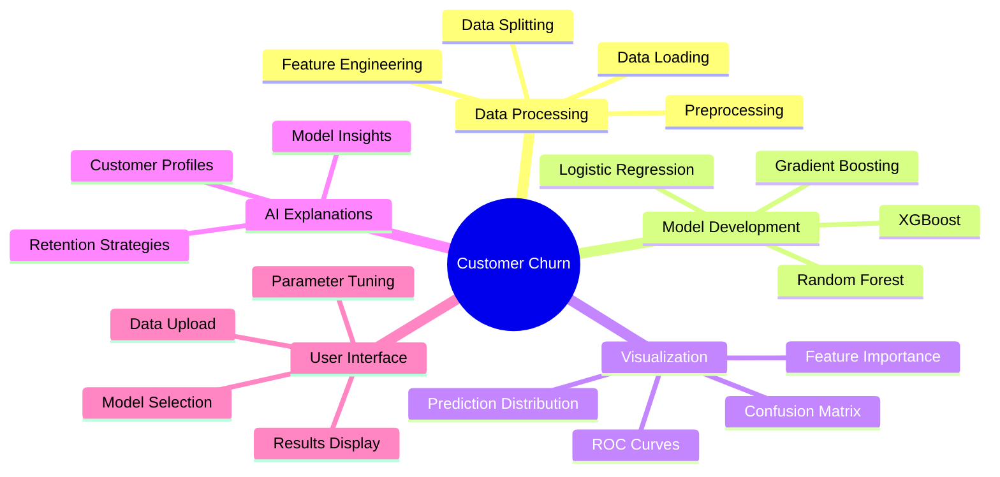
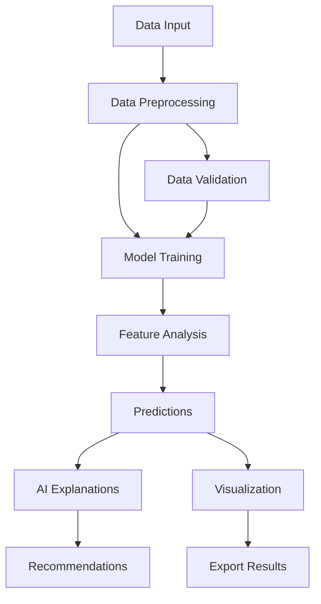
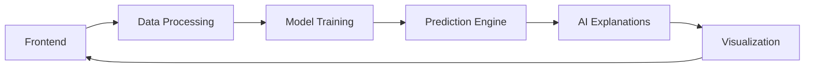

# Customer Churn Prediction Application 🔄

## Abstract 📝
This advanced machine learning application predicts customer churn by analyzing historical customer data. It uses state-of-the-art algorithms to identify patterns and risk factors that contribute to customer attrition, enabling businesses to take proactive retention measures.

## Project Mind Map 🗺️


## Application Flow 📊


## Features ⭐

### 1. Data Management
- Sample dataset integration
- CSV file support
- Automated data preprocessing
- Missing value handling
- Feature encoding

### 2. Model Options
- Random Forest Classifier
- Logistic Regression
- Gradient Boosting
- XGBoost

### 3. Advanced Analytics
- Feature importance analysis
- Performance metrics
- ROC curve visualization
- Confusion matrix
- Prediction distribution

### 4. AI-Powered Insights
- Detailed model explanations
- Customer profile analysis
- Risk assessment
- Personalized retention strategies
- Feature impact analysis

### 5. Interactive UI
- Dark theme interface
- Real-time model training
- Interactive visualizations
- Parameter tuning
- Results export

## Advantages 🌟

1. **Business Impact**
   - Early churn prediction
   - Targeted retention strategies
   - Cost reduction
   - Revenue protection
   - Customer satisfaction improvement

2. **Technical Excellence**
   - Multiple model options
   - Automated preprocessing
   - Robust error handling
   - Scalable architecture
   - Real-time predictions

3. **User Experience**
   - Intuitive interface
   - Interactive visualizations
   - Detailed explanations
   - Export capabilities
   - Sample data integration

## Future Enhancements 🚀

1. **Model Enhancements**
   - Deep learning integration
   - Automated model selection
   - Hyperparameter optimization
   - Model versioning
   - Ensemble methods

2. **Feature Additions**
   - API integration
   - Batch processing
   - Custom model support
   - Advanced visualizations
   - Automated reporting

3. **UI/UX Improvements**
   - Multiple themes
   - Mobile optimization
   - Custom dashboards
   - Interactive tutorials
   - Collaboration features

## Technical Architecture 🏗️


## Getting Started 🚀

1. Open the application in Replit
2. Choose between sample data or upload your own
3. Select a machine learning model
4. Configure model parameters
5. Train the model
6. Analyze results and insights
7. Export predictions and recommendations

## Dependencies 📦
- Streamlit
- Pandas
- NumPy
- Scikit-learn
- XGBoost
- Plotly
- Matplotlib
- Seaborn

## Usage Examples 💡

### Model Training
```python
model_type = "Random Forest"
model_params = {
    "n_estimators": 100,
    "max_depth": 10
}

model, feature_importance = train_model(X_train, y_train, model_type, model_params)
```

### Prediction
```python
predictions, probabilities = predict_churn(model, X_test)
```

### Analysis
```python
insights = analyze_customer_profile(customer_data, feature_importance)
```

## Contributing 🤝
Feel free to fork the project and submit pull requests for any improvements.

## License 📄
MIT License

## Author ✍️
## College 🏫
SKP Engineering College,
Tirvannamalai.
## Devlopers 👩🏻‍💻
1. S.Tamilselvan 
2. P. Vikram
3. K. Pugazhmani 
